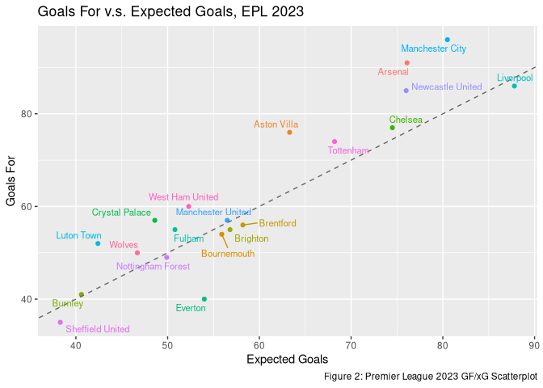
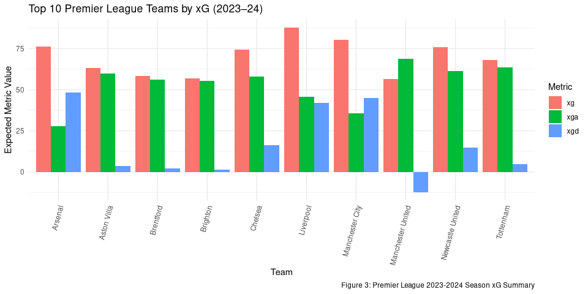
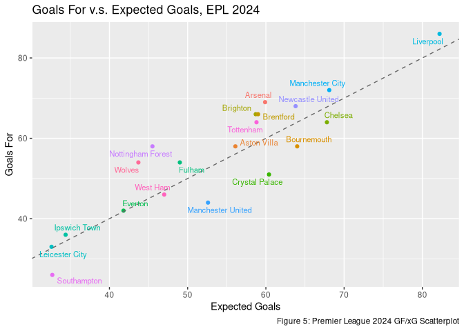
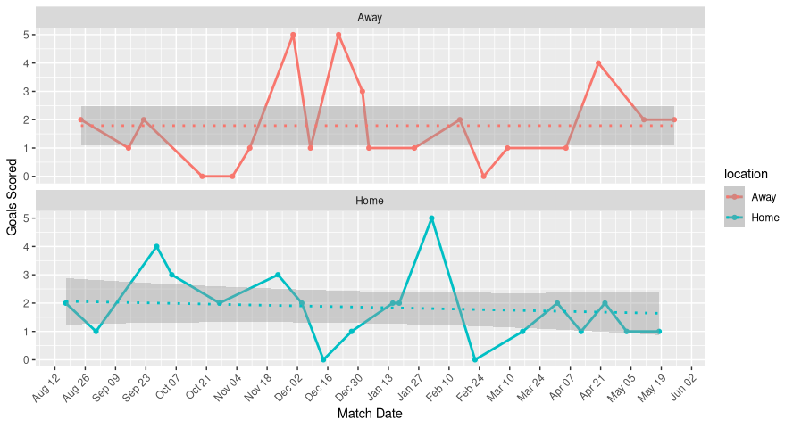
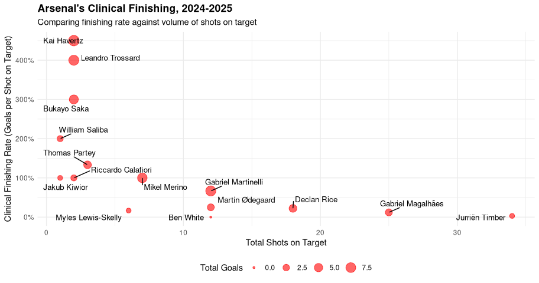

-   [Overview](#overview)
-   [Methodology](#methodology)
-   [Definition of Terms](#definition-of-terms)
-   [Performance in Perspective](#performance-in-perspective)
-   [Who Needs A Striker?](#who-needs-a-striker)
-   [Filling in the Gaps](#filling-in-the-gaps)

## Overview

A(r)senal Analysis is an analytical exploration of Arsenal’s performance
in the **2024-2025** season of the **English Premier League**. The team
was chosen because of their ability to outperform league leaders and top
contenders in the UEFA Champion’s League (particularly their 3-0 win
over Real Madrid) yet showing recurring inconsistencies in front of
goal.

Throughout the season, fans and pundits alike heralded it as *“Arsenal’s
year.”* With Manchester City’s dominance waning, the path to the title
seemed open. Yet by May, Liverpool sat atop the table while Arsenal once
again finished second. The central question, then, is this: how can a
squad strong enough to reach the Champions League semi-finals and
challenge England’s best still struggle to convert that dominance into
goals?

## Methodology

I scraped aggregated match data from FBRef and used Kaggle datasets for
player-level statistics and the official fixture list. The datasets were
stored in a Docker-based MariaDB instance in my homelab for reproducible
querying. Using VSCode’s SQL extensions, I cleaned and normalized data
directly in SQL, then connected RStudio to the database for statistical
exploration and visualization.

### Data Sources

-   EPL Player Match Data:
    <https://www.kaggle.com/datasets/aesika/english-premier-league-player-stats-2425>
    (1 row per player, aggregated statistics for the 2024-2025 season)
-   EPL Fixture Data:
    <https://www.kaggle.com/datasets/secretglory/epl-fixtures-list-2024-2025>
    (Official match schedule as published)
-   EPL Match Data: Scraped from
    <https://fbref.com/en/comps/9/2024-2025/schedule/2024-2025-Premier-League-Scores-and-Fixtures>
    (Aggregated match statistics, per team, for the entire season)
-   EPL Season Table, 2024-2025:
    <https://fbref.com/en/comps/9/2024-2025/2024-2025-Premier-League-Stats>
    (League table from 2024 for context review)
-   Arsenal Squad Data from 2023-2024:
    <https://fbref.com/en/squads/18bb7c10/2024-2025/matchlogs/c9/schedule/Arsenal-Scores-and-Fixtures-Premier-League>
    (Previous season summary stats for context review)
-   EPL Season Table, 2023-2024:
    <https://fbref.com/en/comps/9/2023-2024/2023-2024-Premier-League-Stats>
    (League table from 2023 for context review)

## Definition of Terms

-   **GF**: Goals for
-   **GA**: Goals against
-   **GD**: Goal difference, (GF - GA)
-   **xG**: Expected goals; the number of goals a team/player is
    expected to score in a match. **Higher is better**
-   **xGA**: Expected goals against; the number of goals a team is
    expected to concede in a match. **Lower is better**
-   **xGD**: Expected goal difference; The difference between xG and
    xGA. **Higher is better**

## Performance in Perspective

Arsenal FC is a Premier League club with a storied history. Over the
years, they’ve won 13 English top-flight titles, 14 FA Cups, and 17 FA
Community Shields, among other honors. The club also produced *The
Invincibles*, the legendary 2003–2004 squad that went an entire Premier
League season unbeaten.

Unfortunately, that level of dominance was not to last. Financial
constraints, largely attributed to the construction of the Emirates
Stadium, forced a period of austerity that saw the club struggle for
more than a decade before showing real signs of resurgence. Enter Mikel
Arteta. The former Arsenal captain returned to the club mid-season in
2019 to take up the managerial role. Despite securing an FA Cup title
later that season, it would take several years of rebuilding before
consistent improvement began to show.

### Uphill Battles

The renewed optimism surrounding Arsenal at the start of the 2024–2025
season stemmed from their remarkable form in 2023–2024. There was room
to grow, but this was the most competitive the team had been in a long
while. Finishing 2nd, the team stood out for a couple of reasons.

First, the defensive structure they’d developed. For a team long
associated with defensive lapses, Arsenal’s 2023 season marked a
significant turnaround, recording an xGA of **27.9**, the lowest in the
league. This led to the team conceding only **29** goals throughout the
season, with 2023 champions Manchester City conceding **34** in that
same season.

<table>
<caption>figure 1, Premier League Table, 2023</caption>
<thead>
<tr>
<th style="text-align: right;">rk</th>
<th style="text-align: left;">team_name</th>
<th style="text-align: right;">gf</th>
<th style="text-align: right;">ga</th>
<th style="text-align: right;">gd</th>
<th style="text-align: right;">pts</th>
<th style="text-align: right;">xg</th>
<th style="text-align: right;">xga</th>
</tr>
</thead>
<tbody>
<tr>
<td style="text-align: right;">1</td>
<td style="text-align: left;">Manchester City</td>
<td style="text-align: right;">96</td>
<td style="text-align: right;">34</td>
<td style="text-align: right;">62</td>
<td style="text-align: right;">91</td>
<td style="text-align: right;">80.5</td>
<td style="text-align: right;">35.6</td>
</tr>
<tr>
<td style="text-align: right;">2</td>
<td style="text-align: left;">Arsenal</td>
<td style="text-align: right;">91</td>
<td style="text-align: right;">29</td>
<td style="text-align: right;">62</td>
<td style="text-align: right;">89</td>
<td style="text-align: right;">76.1</td>
<td style="text-align: right;">27.9</td>
</tr>
<tr>
<td style="text-align: right;">3</td>
<td style="text-align: left;">Liverpool</td>
<td style="text-align: right;">86</td>
<td style="text-align: right;">41</td>
<td style="text-align: right;">45</td>
<td style="text-align: right;">82</td>
<td style="text-align: right;">87.8</td>
<td style="text-align: right;">45.7</td>
</tr>
<tr>
<td style="text-align: right;">4</td>
<td style="text-align: left;">Aston Villa</td>
<td style="text-align: right;">76</td>
<td style="text-align: right;">61</td>
<td style="text-align: right;">15</td>
<td style="text-align: right;">68</td>
<td style="text-align: right;">63.3</td>
<td style="text-align: right;">59.9</td>
</tr>
<tr>
<td style="text-align: right;">5</td>
<td style="text-align: left;">Tottenham</td>
<td style="text-align: right;">74</td>
<td style="text-align: right;">61</td>
<td style="text-align: right;">13</td>
<td style="text-align: right;">66</td>
<td style="text-align: right;">68.2</td>
<td style="text-align: right;">63.4</td>
</tr>
<tr>
<td style="text-align: right;">6</td>
<td style="text-align: left;">Chelsea</td>
<td style="text-align: right;">77</td>
<td style="text-align: right;">63</td>
<td style="text-align: right;">14</td>
<td style="text-align: right;">63</td>
<td style="text-align: right;">74.5</td>
<td style="text-align: right;">58.1</td>
</tr>
<tr>
<td style="text-align: right;">7</td>
<td style="text-align: left;">Newcastle United</td>
<td style="text-align: right;">85</td>
<td style="text-align: right;">62</td>
<td style="text-align: right;">23</td>
<td style="text-align: right;">60</td>
<td style="text-align: right;">76.0</td>
<td style="text-align: right;">61.4</td>
</tr>
<tr>
<td style="text-align: right;">8</td>
<td style="text-align: left;">Manchester United</td>
<td style="text-align: right;">57</td>
<td style="text-align: right;">58</td>
<td style="text-align: right;">-1</td>
<td style="text-align: right;">60</td>
<td style="text-align: right;">56.5</td>
<td style="text-align: right;">68.9</td>
</tr>
<tr>
<td style="text-align: right;">9</td>
<td style="text-align: left;">West Ham United</td>
<td style="text-align: right;">60</td>
<td style="text-align: right;">74</td>
<td style="text-align: right;">-14</td>
<td style="text-align: right;">52</td>
<td style="text-align: right;">52.3</td>
<td style="text-align: right;">71.1</td>
</tr>
<tr>
<td style="text-align: right;">10</td>
<td style="text-align: left;">Crystal Palace</td>
<td style="text-align: right;">57</td>
<td style="text-align: right;">58</td>
<td style="text-align: right;">-1</td>
<td style="text-align: right;">49</td>
<td style="text-align: right;">48.6</td>
<td style="text-align: right;">52.0</td>
</tr>
<tr>
<td style="text-align: right;">11</td>
<td style="text-align: left;">Brighton</td>
<td style="text-align: right;">55</td>
<td style="text-align: right;">62</td>
<td style="text-align: right;">-7</td>
<td style="text-align: right;">48</td>
<td style="text-align: right;">56.8</td>
<td style="text-align: right;">55.4</td>
</tr>
<tr>
<td style="text-align: right;">12</td>
<td style="text-align: left;">Bournemouth</td>
<td style="text-align: right;">54</td>
<td style="text-align: right;">67</td>
<td style="text-align: right;">-13</td>
<td style="text-align: right;">48</td>
<td style="text-align: right;">55.9</td>
<td style="text-align: right;">58.1</td>
</tr>
<tr>
<td style="text-align: right;">13</td>
<td style="text-align: left;">Fulham</td>
<td style="text-align: right;">55</td>
<td style="text-align: right;">61</td>
<td style="text-align: right;">-6</td>
<td style="text-align: right;">47</td>
<td style="text-align: right;">50.8</td>
<td style="text-align: right;">62.9</td>
</tr>
<tr>
<td style="text-align: right;">14</td>
<td style="text-align: left;">Wolves</td>
<td style="text-align: right;">50</td>
<td style="text-align: right;">65</td>
<td style="text-align: right;">-15</td>
<td style="text-align: right;">46</td>
<td style="text-align: right;">46.7</td>
<td style="text-align: right;">67.7</td>
</tr>
<tr>
<td style="text-align: right;">15</td>
<td style="text-align: left;">Everton</td>
<td style="text-align: right;">40</td>
<td style="text-align: right;">51</td>
<td style="text-align: right;">-11</td>
<td style="text-align: right;">40</td>
<td style="text-align: right;">54.0</td>
<td style="text-align: right;">55.2</td>
</tr>
<tr>
<td style="text-align: right;">16</td>
<td style="text-align: left;">Brentford</td>
<td style="text-align: right;">56</td>
<td style="text-align: right;">65</td>
<td style="text-align: right;">-9</td>
<td style="text-align: right;">39</td>
<td style="text-align: right;">58.2</td>
<td style="text-align: right;">56.0</td>
</tr>
<tr>
<td style="text-align: right;">17</td>
<td style="text-align: left;">Nottingham Forest</td>
<td style="text-align: right;">49</td>
<td style="text-align: right;">67</td>
<td style="text-align: right;">-18</td>
<td style="text-align: right;">32</td>
<td style="text-align: right;">49.9</td>
<td style="text-align: right;">53.3</td>
</tr>
<tr>
<td style="text-align: right;">18</td>
<td style="text-align: left;">Luton Town</td>
<td style="text-align: right;">52</td>
<td style="text-align: right;">85</td>
<td style="text-align: right;">-33</td>
<td style="text-align: right;">26</td>
<td style="text-align: right;">42.4</td>
<td style="text-align: right;">78.0</td>
</tr>
<tr>
<td style="text-align: right;">19</td>
<td style="text-align: left;">Burnley</td>
<td style="text-align: right;">41</td>
<td style="text-align: right;">78</td>
<td style="text-align: right;">-37</td>
<td style="text-align: right;">24</td>
<td style="text-align: right;">40.6</td>
<td style="text-align: right;">70.4</td>
</tr>
<tr>
<td style="text-align: right;">20</td>
<td style="text-align: left;">Sheffield United</td>
<td style="text-align: right;">35</td>
<td style="text-align: right;">104</td>
<td style="text-align: right;">-69</td>
<td style="text-align: right;">16</td>
<td style="text-align: right;">38.3</td>
<td style="text-align: right;">76.6</td>
</tr>
</tbody>
</table>

Liverpool, who followed with an xGA of **45.7**, conceded **41** goals
which underscored how much Arsenal had closed the defensive gap with the
very best. Arsenal’s attack, meanwhile, showed potential despite the
lack of a traditional number 9 player.

In the chart above, teams above the line are those that overperformed,
or those that scored more goals than expected (GF - xG). We can see that
Arsenal counted themselves among the top when it came to expected goals.

The combination of a strong defence with a budding attacking mindset
would result in an xGD of **48.2**. Manchester City, on the other hand,
finished the season with an xGD of **45**, a little lower than
Arsenal’s.

Arsenal FC would then end that campaign with a mean of **2.39** goals
per match. Combined with an average **0.76** goals conceded per match,
the team appeared poised for another strong run in the following season.

## Who Needs A Striker?

Which brings us to the actual season in question. As an overview, let’s
take a look at the Premier League table at the end of the 2024-2025
season.

<table>
<caption>Figure 4: Premier League Table, 2024</caption>
<thead>
<tr>
<th style="text-align: right;">rk</th>
<th style="text-align: left;">team_name</th>
<th style="text-align: right;">gf</th>
<th style="text-align: right;">ga</th>
<th style="text-align: right;">gd</th>
<th style="text-align: right;">pts</th>
<th style="text-align: right;">xg</th>
<th style="text-align: right;">xga</th>
</tr>
</thead>
<tbody>
<tr>
<td style="text-align: right;">1</td>
<td style="text-align: left;">Liverpool</td>
<td style="text-align: right;">86</td>
<td style="text-align: right;">41</td>
<td style="text-align: right;">45</td>
<td style="text-align: right;">84</td>
<td style="text-align: right;">82.2</td>
<td style="text-align: right;">38.6</td>
</tr>
<tr>
<td style="text-align: right;">2</td>
<td style="text-align: left;">Arsenal</td>
<td style="text-align: right;">69</td>
<td style="text-align: right;">34</td>
<td style="text-align: right;">35</td>
<td style="text-align: right;">74</td>
<td style="text-align: right;">59.9</td>
<td style="text-align: right;">34.4</td>
</tr>
<tr>
<td style="text-align: right;">3</td>
<td style="text-align: left;">Manchester City</td>
<td style="text-align: right;">72</td>
<td style="text-align: right;">44</td>
<td style="text-align: right;">28</td>
<td style="text-align: right;">71</td>
<td style="text-align: right;">68.1</td>
<td style="text-align: right;">47.7</td>
</tr>
<tr>
<td style="text-align: right;">4</td>
<td style="text-align: left;">Chelsea</td>
<td style="text-align: right;">64</td>
<td style="text-align: right;">43</td>
<td style="text-align: right;">21</td>
<td style="text-align: right;">69</td>
<td style="text-align: right;">67.8</td>
<td style="text-align: right;">47.3</td>
</tr>
<tr>
<td style="text-align: right;">5</td>
<td style="text-align: left;">Newcastle United</td>
<td style="text-align: right;">68</td>
<td style="text-align: right;">47</td>
<td style="text-align: right;">21</td>
<td style="text-align: right;">66</td>
<td style="text-align: right;">63.8</td>
<td style="text-align: right;">45.5</td>
</tr>
<tr>
<td style="text-align: right;">6</td>
<td style="text-align: left;">Aston Villa</td>
<td style="text-align: right;">58</td>
<td style="text-align: right;">51</td>
<td style="text-align: right;">7</td>
<td style="text-align: right;">66</td>
<td style="text-align: right;">56.1</td>
<td style="text-align: right;">50.1</td>
</tr>
<tr>
<td style="text-align: right;">7</td>
<td style="text-align: left;">Nottingham Forest</td>
<td style="text-align: right;">58</td>
<td style="text-align: right;">46</td>
<td style="text-align: right;">12</td>
<td style="text-align: right;">65</td>
<td style="text-align: right;">45.5</td>
<td style="text-align: right;">48.9</td>
</tr>
<tr>
<td style="text-align: right;">8</td>
<td style="text-align: left;">Brighton</td>
<td style="text-align: right;">66</td>
<td style="text-align: right;">59</td>
<td style="text-align: right;">7</td>
<td style="text-align: right;">61</td>
<td style="text-align: right;">58.7</td>
<td style="text-align: right;">54.6</td>
</tr>
<tr>
<td style="text-align: right;">9</td>
<td style="text-align: left;">Bournemouth</td>
<td style="text-align: right;">58</td>
<td style="text-align: right;">46</td>
<td style="text-align: right;">12</td>
<td style="text-align: right;">56</td>
<td style="text-align: right;">64.0</td>
<td style="text-align: right;">48.5</td>
</tr>
<tr>
<td style="text-align: right;">10</td>
<td style="text-align: left;">Brentford</td>
<td style="text-align: right;">66</td>
<td style="text-align: right;">57</td>
<td style="text-align: right;">9</td>
<td style="text-align: right;">56</td>
<td style="text-align: right;">59.0</td>
<td style="text-align: right;">55.4</td>
</tr>
<tr>
<td style="text-align: right;">11</td>
<td style="text-align: left;">Fulham</td>
<td style="text-align: right;">54</td>
<td style="text-align: right;">54</td>
<td style="text-align: right;">0</td>
<td style="text-align: right;">54</td>
<td style="text-align: right;">49.0</td>
<td style="text-align: right;">47.2</td>
</tr>
<tr>
<td style="text-align: right;">12</td>
<td style="text-align: left;">Crystal Palace</td>
<td style="text-align: right;">51</td>
<td style="text-align: right;">51</td>
<td style="text-align: right;">0</td>
<td style="text-align: right;">53</td>
<td style="text-align: right;">60.4</td>
<td style="text-align: right;">49.1</td>
</tr>
<tr>
<td style="text-align: right;">13</td>
<td style="text-align: left;">Everton</td>
<td style="text-align: right;">42</td>
<td style="text-align: right;">44</td>
<td style="text-align: right;">-2</td>
<td style="text-align: right;">48</td>
<td style="text-align: right;">41.8</td>
<td style="text-align: right;">46.2</td>
</tr>
<tr>
<td style="text-align: right;">14</td>
<td style="text-align: left;">West Ham</td>
<td style="text-align: right;">46</td>
<td style="text-align: right;">62</td>
<td style="text-align: right;">-16</td>
<td style="text-align: right;">43</td>
<td style="text-align: right;">47.0</td>
<td style="text-align: right;">59.7</td>
</tr>
<tr>
<td style="text-align: right;">15</td>
<td style="text-align: left;">Manchester United</td>
<td style="text-align: right;">44</td>
<td style="text-align: right;">54</td>
<td style="text-align: right;">-10</td>
<td style="text-align: right;">42</td>
<td style="text-align: right;">52.6</td>
<td style="text-align: right;">53.8</td>
</tr>
<tr>
<td style="text-align: right;">16</td>
<td style="text-align: left;">Wolves</td>
<td style="text-align: right;">54</td>
<td style="text-align: right;">69</td>
<td style="text-align: right;">-15</td>
<td style="text-align: right;">42</td>
<td style="text-align: right;">43.7</td>
<td style="text-align: right;">58.1</td>
</tr>
<tr>
<td style="text-align: right;">17</td>
<td style="text-align: left;">Tottenham</td>
<td style="text-align: right;">64</td>
<td style="text-align: right;">65</td>
<td style="text-align: right;">-1</td>
<td style="text-align: right;">38</td>
<td style="text-align: right;">58.8</td>
<td style="text-align: right;">63.3</td>
</tr>
<tr>
<td style="text-align: right;">18</td>
<td style="text-align: left;">Leicester City</td>
<td style="text-align: right;">33</td>
<td style="text-align: right;">80</td>
<td style="text-align: right;">-47</td>
<td style="text-align: right;">25</td>
<td style="text-align: right;">32.6</td>
<td style="text-align: right;">71.9</td>
</tr>
<tr>
<td style="text-align: right;">19</td>
<td style="text-align: left;">Ipswich Town</td>
<td style="text-align: right;">36</td>
<td style="text-align: right;">82</td>
<td style="text-align: right;">-46</td>
<td style="text-align: right;">22</td>
<td style="text-align: right;">34.4</td>
<td style="text-align: right;">72.7</td>
</tr>
<tr>
<td style="text-align: right;">20</td>
<td style="text-align: left;">Southampton</td>
<td style="text-align: right;">26</td>
<td style="text-align: right;">86</td>
<td style="text-align: right;">-60</td>
<td style="text-align: right;">12</td>
<td style="text-align: right;">32.7</td>
<td style="text-align: right;">84.8</td>
</tr>
</tbody>
</table>

Again, second place despite having the league’s best defensive
structure. Arsenal’s defense conceded only **34** goals throughout the
season, beating the champions Liverpool who conceded **41** goals. This
only makes it apparent that their difficulties in getting the ball to
the back of the net still outweighed their defensive capabilities.

But who is responsible for that task? At this point in time, Arsenal had
its number 9 in the form of Kai Havertz, a player who *isn’t necessarily
a traditional striker*. Combined with their aggressive midfield, we can
see where Arsenal pulled most of its goals from.

<table>
<caption>Figure 5: Cumulative goal share, 2024</caption>
<thead>
<tr>
<th style="text-align: left;">player_label</th>
<th style="text-align: right;">goals</th>
<th style="text-align: right;">goal_share</th>
<th style="text-align: right;">cum_share</th>
</tr>
</thead>
<tbody>
<tr>
<td style="text-align: left;">Kai Havertz (FWD)</td>
<td style="text-align: right;">9</td>
<td style="text-align: right;">0.1363636</td>
<td style="text-align: right;">0.1363636</td>
</tr>
<tr>
<td style="text-align: left;">Gabriel Martinelli (MID)</td>
<td style="text-align: right;">8</td>
<td style="text-align: right;">0.1212121</td>
<td style="text-align: right;">0.2575758</td>
</tr>
<tr>
<td style="text-align: left;">Leandro Trossard (MID)</td>
<td style="text-align: right;">8</td>
<td style="text-align: right;">0.1212121</td>
<td style="text-align: right;">0.3787879</td>
</tr>
<tr>
<td style="text-align: left;">Mikel Merino (MID)</td>
<td style="text-align: right;">7</td>
<td style="text-align: right;">0.1060606</td>
<td style="text-align: right;">0.4848485</td>
</tr>
<tr>
<td style="text-align: left;">Bukayo Saka (MID)</td>
<td style="text-align: right;">6</td>
<td style="text-align: right;">0.0909091</td>
<td style="text-align: right;">0.5757576</td>
</tr>
</tbody>
</table>

On this table we have the top 5 goal shares from that season. We can see
that most of the team’s goals come from the midfield players with a
total of **29** goals between them, and Kai Havertz providing a further
**9** goals on top of that.

In fact, in terms of cumulative shares, Kai Havertz, Gabriel Martinelli,
Leandro Trossard, and Mikel Merino all claim a combined **48.48%** of
Arsenal’s total goals from 2024-2025. But while these players threatened
the goal when they were on the pitch, injuries would limit their
availability. Let’s take a look at the players with the most minutes:

<table>
<caption>Figure 6: Top 5 Arsenal Player Attendance</caption>
<thead>
<tr>
<th style="text-align: left;">player_name</th>
<th style="text-align: left;">position</th>
<th style="text-align: right;">appearances</th>
<th style="text-align: right;">minutes</th>
<th style="text-align: right;">goals</th>
<th style="text-align: right;">assists</th>
</tr>
</thead>
<tbody>
<tr>
<td style="text-align: left;">David Raya</td>
<td style="text-align: left;">GKP</td>
<td style="text-align: right;">38</td>
<td style="text-align: right;">3420</td>
<td style="text-align: right;">0</td>
<td style="text-align: right;">0</td>
</tr>
<tr>
<td style="text-align: left;">William Saliba</td>
<td style="text-align: left;">DEF</td>
<td style="text-align: right;">35</td>
<td style="text-align: right;">3041</td>
<td style="text-align: right;">2</td>
<td style="text-align: right;">0</td>
</tr>
<tr>
<td style="text-align: left;">Declan Rice</td>
<td style="text-align: left;">MID</td>
<td style="text-align: right;">35</td>
<td style="text-align: right;">2833</td>
<td style="text-align: right;">4</td>
<td style="text-align: right;">7</td>
</tr>
<tr>
<td style="text-align: left;">Thomas Partey</td>
<td style="text-align: left;">MID</td>
<td style="text-align: right;">35</td>
<td style="text-align: right;">2799</td>
<td style="text-align: right;">4</td>
<td style="text-align: right;">0</td>
</tr>
<tr>
<td style="text-align: left;">Leandro Trossard</td>
<td style="text-align: left;">MID</td>
<td style="text-align: right;">38</td>
<td style="text-align: right;">2550</td>
<td style="text-align: right;">8</td>
<td style="text-align: right;">7</td>
</tr>
</tbody>
</table>

From this list, only Leandro Trossard provided a big conribution to
Arsenal’s total goals. While it could be argued that Declan Rice
provided **7** assists aside from **4** goals, his role in the team is
less “striker” and more “controller”. The rest of the attacking or high
scoring players would end up injured, further limiting Arsenal’s
goal-scoring edge.

What’s important is what we don’t see—strikers who *aren’t* named Kai
Havertz. With Havertz being the sole striker, the team is reliant on the
German to provide that kind of attacking behavior that midfielders and
wingers don’t come naturally with.

Now, let’s take into account Arsenal’s goal scoring trends over the
season.

With the dashed-line showing the rolling averages, we can see that
Arsenal’s scoring form still suffers from inconsistencies. This only
supports the argument that the team just didn’t have the depth they
needed to cover for absences caused by injuries.

But is it the players’ fault? After all, personal challenges could cause
players to underperform. This graph shows how efficient each player is
in terms of goal-scoring by comparing their **goals per shot on target**
against their **total shots on target**. The size of each point
determines how many goals that player actually scored.

With the Y-axis showing us the player’s *clinical finishing rate* and
the X-axis showing *shots on target*, it’s clear that Arsenal’s
attacking formation can’t hit the target as much as they wanted to. Take
Martin Odegaard, for example; the player is capable of getting into a
position where he can shoot a ball on-target, but the man faces
difficulties getting past the keeper. On the other hand, we have players
like Kai Havertz who only have a few shots on-target but have a high
finishing rate (higher than 100%!). This is an interesting point with
the data that shows how the definition of a “Shot on Target” doesn’t
actually define a goal. For example, a player might shoot and “miss”,
but have the ball deflect into the goal via own-goal.

What we can then derive from the chart is that, while still a capable
team, Arsenal’s problem remains the same; they **need** a number 9, a
traditional striker that converts chances into actual goals.

The team would end the season with a total xG of **59.9**, a far cry
from last season’s **76.1**. Despite scoring more than their xG, that’s
still a **-21.29%** change in their expected goal performance, a
tell-tale sign that their chance creation is **not** what it was.

So, to anser the question of, “Who needs a striker?” the answer is
definitely Arsenal.

## Filling in the Gaps

\[section discusses predictive stats/conclusions\]
