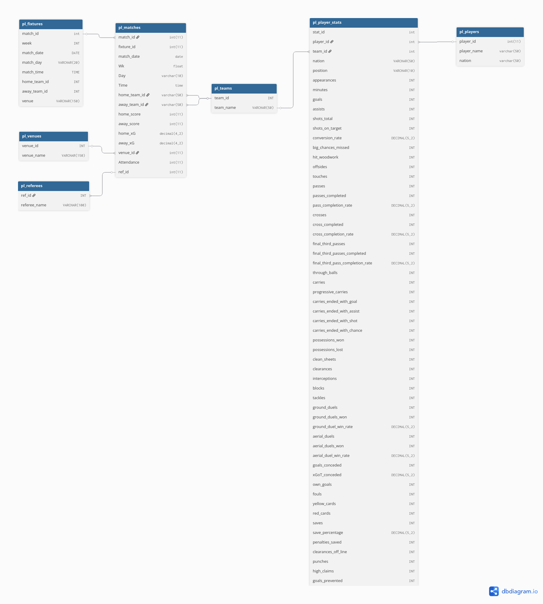

# About
This English Premier League data analytics repository is a project aimed at helping me learn more about SQL and R. The R analytics section was done in conjunction with the Google Data Analytics Professional Certificate program on Coursera. This involves:
- an exercise in data cleanup, normalization, and analysis with SQL. 
- exploratory analysis in R (via MariaDB connector to homelab server)

Both make use of 3 datasets focused on the 2024-2025 season of the English Premiere League; one dataset to supply official fixtures, another for row-level player statistics per match, and lastly one for overall match statistics and information.

Data sources:
1. EPL Player Match Data: https://www.kaggle.com/datasets/aesika/english-premier-league-player-stats-2425
(1 row per player, aggregated statistics for the 2024-2025 season)
2. EPL Fixture Data: https://www.kaggle.com/datasets/secretglory/epl-fixtures-list-2024-2025
(Official match schedule as published)
3. EPL Match Data: Scraped from https://fbref.com/en/comps/9/2024-2025/schedule/2024-2025-Premier-League-Scores-and-Fixtures
(Aggregated match statistics, per team, for the entire season)

Environment:
1. Homelab Server: Debian 13 running a Dockerized MariaDB instance (data storage and normalization).
2. Client Machine: CachyOS (Arch Linux) with VSCode (SQL + R extensions) and RStudio for analytical workflow and visualization.
3. Software Stack: R 4.4, tidyverse ecosystem, RMariaDB connector, Git + GitHub version control.

## Schema [SQL]
** See below for visual diagram **
pl_players: player_id (Primary Key), player_name, nation
pl_teams: team_id (Primary Key), team_name
pl_matches: match_id (Primary Key), fixture_id (Foreign Key), match_date, Wk, Day, Time, home_team_id, away_team_id, home_score, away_score, home_xG, away_xG, venue_id (Foreign Key), Attendance, ref_id

## Cleanup [SQL]
Cleanup was mostly about making sure naming conventions were parallel across all tables (Manchester United vs Manchester Utd). There are instances of a wrong entry in the referee column of the pl_matches table. I've corrected what I can but given the level of data and the purpose of this project I've chosen not to do a full replacement until later on. 

## Normalizing Data [SQL]
In order to maximize efficiency when querying for analysis, I split the data from the raw sets into six (6) tables; pl_players, pl_teams, pl_referees, pl_venues, pl_matches, and pl_player_stats. Each table has its own unique Primary Key and references Foreign Keys from the others where applicable, with the goal achieving at least 3rd Normal Form.

## General Exploration [SQL]
The SQL exploration portion is dedicated to league-wide analysis. Found in this section are queries involving mupltiple joins, CTEs, and CASE statements. 

## Analyzing A(R)senal
Using R, we explore Arsenal's season metrics. This section is intended to present statistical analyses and visualizations, using some of R's many packages. 

### R packages used:
- DBI
- RMariaDB
- ggplot2
- dplyr
- dbplyr

